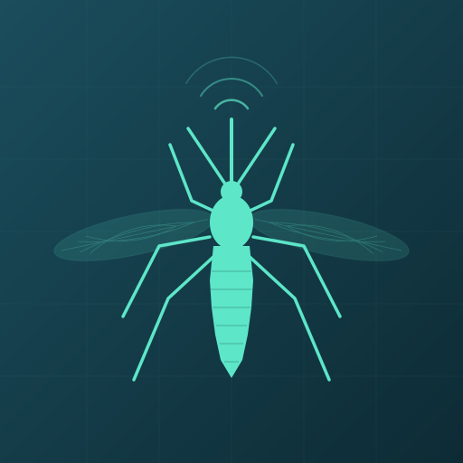

<p align="center">
  
</p>

<h1 align="center">Macquitto</h1>

<p align="center">
  A native macOS menu bar agent that exposes system sensors and actions to
  <a href="https://www.home-assistant.io">Home Assistant</a> via MQTT.
</p>

<p align="center">
  
  
  
</p>

---

Macquitto runs quietly in your menu bar and publishes Mac system state to Home Assistant through MQTT discovery. Use it to build automations based on your Mac's volume, screen lock, battery level, focus mode, and display brightness — or control them remotely.

## Sensors

| Sensor | Entities | Poll Interval |
|--------|----------|---------------|
| **Audio** | Volume level, mute state, output device name | 2s |
| **Screen Lock** | Locked / Unlocked | 5s |
| **Display Brightness** | Built-in display brightness % | 10s |
| **Focus Mode** | Do Not Disturb / Focus on or off | 10s |
| **Battery** | Battery level %, charging state | 60s |

All sensors use [MQTT Discovery](https://www.home-assistant.io/integrations/mqtt/#mqtt-discovery) and appear automatically in Home Assistant.

## Actions

| Action | MQTT Command | Payload |
|--------|-------------|---------|
| **Set Volume** | `macquitto/{device_id}/set_volume` | `0`–`100` |
| **Set Mute** | `macquitto/{device_id}/set_mute` | `true` / `false` |
| **Screen Lock** | `macquitto/{device_id}/screen_lock` | `lock` |
| **Set Brightness** | `macquitto/{device_id}/set_brightness` | `0`–`100` |

## Installation

### Build from source

Requires Xcode 15+ or the Swift 5.10 toolchain.

```bash
git clone https://github.com/dennispg/macquitto.git
cd macquitto
./scripts/build-app.sh
```

The app bundle is created at `.build/release/Macquitto.app`. Copy it to `/Applications/` or run it directly:

```bash
open .build/release/Macquitto.app
```

### Headless mode

Run without the menu bar UI (useful for headless Macs or running as a background service):

```bash
swift build -c release
.build/release/Macquitto --headless
```

## Configuration

Config is stored at `~/.config/macquitto/config.yaml`. A default config is created on first launch.

```yaml
device:
  id: "your-hardware-uuid"
  name: "My Mac"
mqtt:
  host: "homeassistant.local"
  port: 1883
  tls: false
  username: "mqtt_user"
  discovery_prefix: "homeassistant"
  base_topic: "macquitto"
  keepalive: 60
sensors:
  audio:
    enabled: true
    poll_interval: 2
  screen_lock:
    enabled: true
    poll_interval: 5
  brightness:
    enabled: true
    poll_interval: 10
  focus:
    enabled: true
    poll_interval: 10
  battery:
    enabled: true
    poll_interval: 60
general:
  show_menu_bar_icon: true
  log_level: "info"
```

### MQTT password

The MQTT password is stored in the macOS Keychain, not in the config file.

Set it from the command line:

```bash
.build/release/Macquitto --set-password
```

Or enter it in the Settings window under the MQTT tab.

### CLI options

```
--headless       Run without menu bar UI
--config <path>  Path to config file (default: ~/.config/macquitto/config.yaml)
--set-password   Set MQTT password in Keychain
--show-config    Print current config (password redacted)
--version        Print version
```

## How it works

Macquitto connects to your MQTT broker and publishes [Home Assistant MQTT Discovery](https://www.home-assistant.io/integrations/mqtt/#mqtt-discovery) messages for each sensor. Home Assistant automatically creates entities for the device. Sensor values are polled at configurable intervals and published to MQTT state topics.

Actions are handled by subscribing to MQTT command topics. When Home Assistant (or any MQTT client) publishes to a command topic, Macquitto executes the corresponding system action.

If the MQTT connection drops, sensors continue polling locally and the agent reconnects automatically. The menu bar icon shows connection status with a red dot when disconnected.

## License

[MIT](LICENSE)
